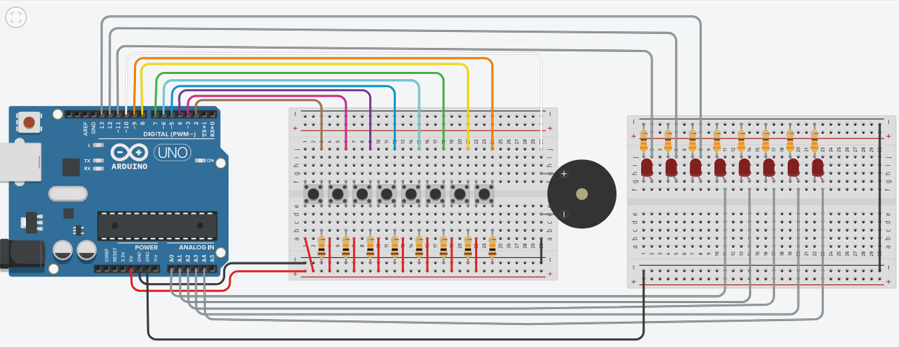

# PianoTutor

## Descrição  
O **Piano Tutor** é um projeto escolar desenvolvido com **Arduino** que simula um piano para auxiliar estudantes iniciantes. Ele busca oferecer uma alternativa acessível para quem deseja aprender a tocar, mas não tem acesso a um instrumento real.  

## Problema  
A acessibilidade a instrumentos e aulas de música sempre foi um desafio. Muitas pessoas querem aprender a tocar **piano**, mas o alto custo tanto do instrumento quanto das aulas acaba sendo um grande obstáculo. O **Piano Tutor** surge como uma solução acessível para iniciantes, permitindo o aprendizado de forma prática e interativa.  

## Público-alvo  
O projeto é voltado para **estudantes iniciantes no piano** que não possuem acesso a um instrumento físico, oferecendo uma experiência educacional acessível e estimulante.  

## Funcionalidades  
- **Simulação de Piano**: Reprodução de notas musicais ao toque.  
- **Modo de Aprendizado**: Auxílio para iniciantes com indicação de notas.  
- **Interação com Arduino**: Utilização de sensores para simular teclas do piano.  

## Equipe  
- **Líder de Projeto** – Antonio Mateus (teuosx)  
- **Desenvolvedor Backend** – Eduarda Noronha (Eduarrda7444)  
- **Desenvolvedor Backend** – Murilo Alves (Muril08)  
- **Desenvolvedor Backend** – Emilly Vitoria (emillyfernb)  
- **Desenvolvedor Frontend e Designer** – Julio Cesar  
- **Desenvolvedor Frontend e Designer** – Daniel Eduardo  

<a href="https://www.tinkercad.com/things/aEWSyZdIjGP-piano-com-leds-2-protoboards?sharecode=BNVdf9izXELXVY2jGTgpysTxdwZR4K1D-Vpm_em6TBs">Link do Projeto no Tinkercad</a>

